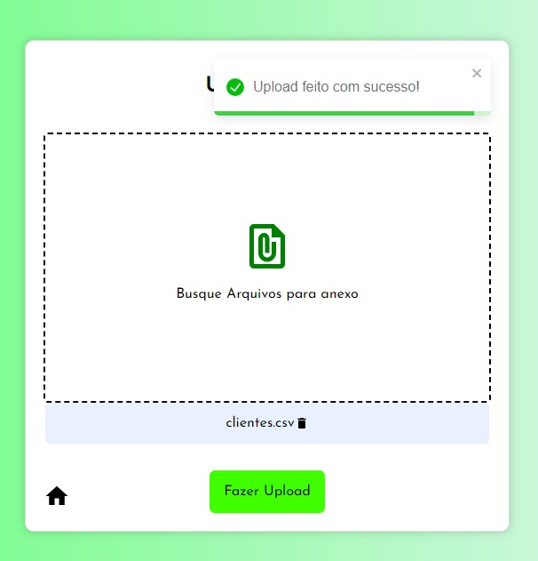
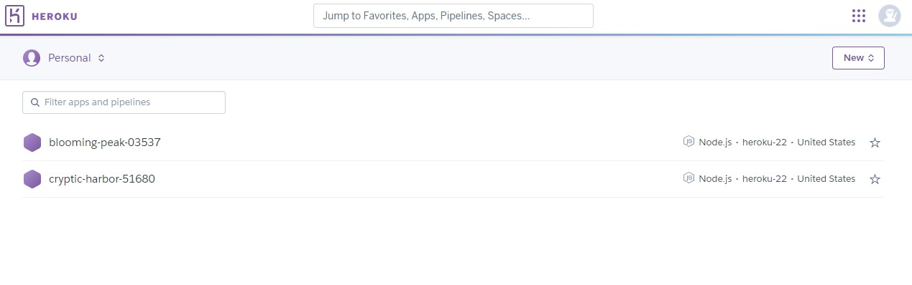

# Projeto Sinka

Esse projeto foi proposto pela empresa Sinka em um desafio para uma vaga.

https://blooming-peak-03537-6f136dd9b456.herokuapp.com/


## Stacks utilizadas

**Front-end:** React, CSS

**Back-end:** Node, Nest e Prisma - MySql


## Requisitos

- Utilização de GIT
- Framework Backend e Frontend
- Stack Recomendada
- Node.js+MySQL+React.js

## Diferencial
- Exportar dados em formato CSV
- Disponibilizar o projeto em uma cloud para testes e nos enviar o link para utilizarmos como usuários
- CRUD dos Operadores
- Função para redistribuir clientes(caso mais operadores sejam adicionados após importação)
- Testes

## Core do Projeto

Tendo como foco cumprir requisitos e diferenciais adotei a tecnologia Nest para fazer meu backend com um arquitetura limpa, construindo testes com Jest. Fiz uso do ORM prisma, me comunicando com um banco MySql em Cloud. Além disso, utilizei React para criar meu frontend, técnicas de componentização e estilização com CSS.

Mantive minha ideia em criar o CRUD dos operadores e conseguir criar os clientes pelos arquivos de entrada, buscar clientes mediante acesso dos operadores e deletar clientes para não prejudicar o CRUD dos operadores, visto que clientes são compreendidos como chave estrangeira para o operador. 

Minha relação de tabelas ilustradas pelo Prisma:

```bash
  model Operador {
  id            String    @id
  nome          String
  clientes      Cliente[]
  criado_em     DateTime
  atualizado_em DateTime
}

model Cliente {
  id              String   @id
  nome            String
  data_nascimento DateTime
  valor           Float
  email           String   @unique
  operador        Operador @relation(fields: [operadorId], references: [id])
  operadorId      String
  criado_em       DateTime
  atualizado_em   DateTime
}
```

## Rotas Backend
Já no Backend tenho essas rotas:

### Clientes:

* #### Cria um cliente

    ```http
        POST /cliente
    ```

    | Parâmetro   | Tipo       | Descrição                           |
    | :---------- | :--------- | :---------------------------------- |
    | `file` | `file` | **Obrigatório**. O arquivo enviado para ser processado como cliente |


* #### Retorna clientes por ID de operador

    ```http
        GET /cliente/${id}
    ```

    | Parâmetro   | Tipo       | Descrição                                   |
    | :---------- | :--------- | :------------------------------------------ |
    | `id`      | `string` | **Obrigatório**. O ID do operador para buscar clientes |

* #### Gera e retorna um CSV de clientes (caso exista)

    ```http
        GET /cliente
    ```


* #### Deleta clientes (caso exista)

    ```http
        GET /cliente
    ```

### Operadores:

* #### Cria um operador

    ```http
        POST /operador
    ```

    | Body   | Tipo       | Descrição                           |
    | :---------- | :--------- | :---------------------------------- |
    | `nome` | `string` | **Obrigatório**.  Nome do operador. |


* #### Edita um operador

    ```http
        PUT /operador/:id
    ```

    | Parâmetro   | Tipo       | Descrição                                   |
    | :---------- | :--------- | :------------------------------------------ |
    | `id`      | `string` | **Obrigatório**. O ID do operador a ser editado. |
    | `nome`      | `string` | **Obrigatório**. Novo nome do operador. |

* #### Deleta um operador

    ```http
        DELETE /operador/:id
    ```

    | Parâmetro   | Tipo       | Descrição                           |
    | :---------- | :--------- | :---------------------------------- |
    | `id` | `string` | **Obrigatório**. O ID do operador a ser deletado. |

* #### Retorna um operador por ID

    ```http
        GET /operador/:id
    ```
    | Parâmetro   | Tipo       | Descrição                           |
    | :---------- | :--------- | :---------------------------------- |
    | `id` | `string` | **Obrigatório**. O ID do operador a ser retornado. |

* #### Retorna todos os operadores

    ```http
        GET /operador
    ```

## Demonstração Frontend
E assim ficou o consumo do backend no frontend:

Eu tenho aba para operadores e clientes.

Posso adicionar Operadores, tratando dados de envio e criando reações para login e caso de sucesso e insucesso para todas as ações de comunicação com o backend.

Aba Inicial


Aba para criação de operadores


Aqui posso editar meus operadores e deletá-los. Ao deletar um operador eu reordeno em ordem de criação meus clientes para vincularem em ordem de criação aos meus operadores, fazendo uma distribuição sequencial. Ao clicar em um operador, visualizo os clientes relacionados a ele.

Aba para visualização, deleção e edição de operadores.


Aba para visualização de clientes relacionados ao Id de um operador.


Ao inserir o documento csv que espera o padrão:
nome, nascimento, valor, email
Cliente 01, 25/05/1985, 042.42, cliente01@teste.com.br, eu manipulo e gravo linha por linha no banco relacionando sequencialmente os clientes gerados aos meus operadores, novamente fazendo a busca de ordem de criação.

Aba para inserir documento csv



Posso também exportar todos os clientes do banco de dados em formato csv, retornando no mesmo formato que é recebido, porém em ordem de criação no banco. Além disso posso fazer a deleção de todos clientes de uma vez.
## Deploy

Para fazer o deploy desse projeto gerei arquivos de DockerFile, com a intenção de criar um Docker Compose e rodar em cloud, porém minha host não permitia a criação de um Docker Compose para rodar minha aplicação, mesmo funcionando tive que abrir mão do meu container. Assim realizei o deploy na Heroku fazendo adições em meus arquivos e utilizando a CLI da Heroku, criando duas aplicações uma para sustentar o backend e outra para o frontend. Quem sabe esse docker sirva para algo futuramente rsrs. 




## Conclusão

Por fim, após dificuldades e aprendizados conclui no dia 12/09 como proposto para encerrar o desafio, conseguindo gabaritar todos requisitos e diferenciais solicitados para o desafio, confirmando minhas habilidades e capacidades de resolver problemas e domínios de ferramentas de programação.

